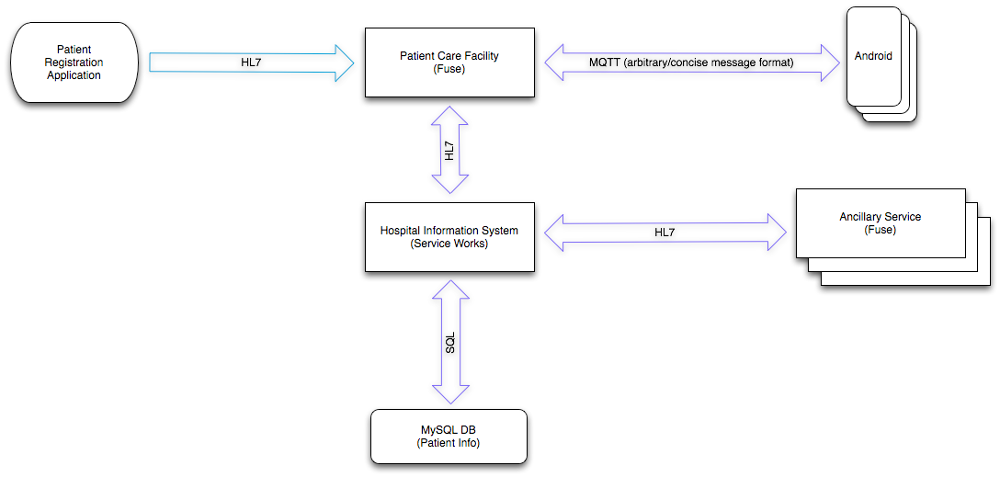
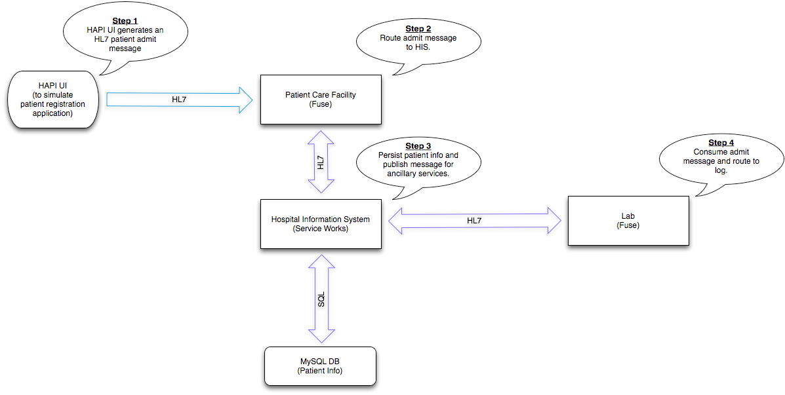
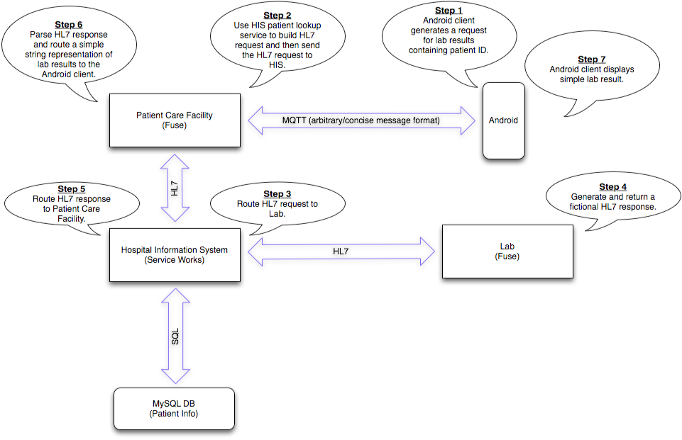

My Health by JBoss
========
Introduction
--------
This document outlines the basic application architecture, describes each of the two supported use cases, describes the message types used throughout the architecture, and provides a set of installation prerequisites. Several of the folders within this repository also contain README files to provide component-level overviews and installation instructions. After installation is complete, the [user's guide](./UsersGuide.md) in this folder will help to guide the reader through use cases.

Overview
--------
The purpose of this application is to provide a reference architecture that demonstrates some features of Fuse 6, Fuse Service Works, and MQTT on Android. A medical setting was chosen for this demonstration and use cases were designed to exercise cooperation between medical facilities and caregivers. The diagram below outlines the major components and the basic relationships between them.




The **Hospital Information System** is the central management application that coordinates the flow of information between Ancillary Services and Patient Care Facilities.

The **Patient Registration Application** represents the software application that provides a way to enter information about newly admited patients into the Hospital Information System. In this architecture, the Patient Registration Application is hosted by the Patient Care Facility and employees of that facility are responsible for patient data entry.

The **Patient Care Facility** represents a hospital-affiliated medical practice. This could be a family medical practice or a pediatric practice, for example. In real-world applications, multiple Patient Care Facilities would likely be connected to a network of one or more Hospital Information Systems.

The **Ancillary Service** represents a specialized service provider. This could be a pharmacy or a laboratory, for example. In real-world applications, multiple Ancillary Services would likely be connected to a network of one or more Hospital Information Systems.

**Android** clients represent the smart devices that are used by doctors and nurses to place orders and request information.


Use Case 1
--------
In the first use case, a patient is admited to the Patient Care Facility. As shown in the diagram below, patient information is submitted to the Patient Care Facility via a HAPI test panel (which is used to simulate a Patient Registration Application), stored by the Hospital Information System, and finally forwarded to the laboratory. The "lab" in the diagram is a "Laboratory Information System" and is used in this architecture to provide an example ancillary service.




Use Case 2
--------
In the second use case, a caregiver requests a test from the lab. The request comes in to the Patient Care Facility from the Android client and is ultimately processed by the lab. Once the test has been performed, test results are sent back to the client. In order to build a more complete request, the Patient Care Facility calls upon the Hospital Information System's patient lookup service to provide additional patient information. In this demonstration, that additional patient information is simply the patient's last name which was stored in the database as part of the first use case.




Message Types
--------
###HL7 Messages
HL7 messages carry information between major system components. HL7 Patient Admit messages that are generated by the HAPI Test Panel come into the Patient Care Facility via MLLP. Throughout the rest of the architecture, HL7 messages are passed between system components as JMS text messages. The list below describes each of the five HL7 messages that are used.

####ADT-A01
The Patient Admit message indicates that a new patient has been admitted. This message is generated by the Patient Registration Application (simulated with the HAPI test panel).
####A19-Qry
The Patient Query message used to gather patient information. The Patient Care Facility sends this message to the Hospital Information System as part of the process of building an ORM-O01 message.
####A19-Qry
The Patient Query Response message contains requested patient information. The Patient Care Facility receives this message from the Hospital Information System in response to the A19-Qry message.
####ORM-O01
The Observation Request message used to order a lab test. The Laboratory Information System receives this message and responds with an ORU-R01 message.
####ORU-R01
The Observation Result message contains the lab test results. The Laboratory Information System sends this message in response to an ORU-R01 message.


###AHE Messages
For Android clients, a more concise message format was needed. The chosen format has been arbitrarily named "AHE" (Abbreviated HL7 Exchange). An AHE message looks like a URL path followed by a query string. The path part establishes the HL7 message type and trigger event while the query string contains the properties that provide context. See the format definition below.

```
<message type>.<trigger event>?<properties>
```
...and an example:
```
ORU.R01?code=87880&text=Negative&patient.surname=Smith
```
The example above is an observation result (the results of a lab test). The code is the [LOINC](http://loinc.org/) identifier associated with a particular type of strep test. The text property contains the actual results ("Negative" indicates that no strep bacteria were detected). The patient.surname property contains the last name of the patient.


Installation Prerequisites
--------

Before beginning the installation process, the items in the list below should be installed.

* Redhat Enterprise Linux 6 is the preferred OS (other Linux distributions may work)

* Java JDK (1.6_18 or better)

* Fuse IDE (the most recent version)

* Git

* MySQL Community Server

* Apache Maven 3.0.5 ([later versions may not play well with the Android build](http://stackoverflow.com/questions/17293940/soap-enabler-maven-build-failure))

* [The settings.xml file](./settings.xml) from this folder should be copied to Maven's ~/.m2 folder.

Go ahead and clone (git clone) this repository into the directory of your choice. Throughout the remaining documentation, this directory will be referred to as \<base_dir\>.


A Note About ActiveMQ and HornetQ
--------
This reference architecture was designed to work with ActiveMQ as the message broker on the Patient Care Facility, the Hospital Information System, and ancillary services. However, the Beta version of JBoss Fuse Service Works 6.0 includes support for HornetQ exclusively and, as a result, the Hospital Information System currently uses HornetQ. This architecture was designed to make heavy use of virtual topics which are not directly supported by HornetQ. There are currently a few workarounds within the architecture that allow the original design to remain relevant while HornetQ is in use on the Hospital Information System. This is all temporary - the plan is to move the Hospital Information System to ActiveMQ when support for ActiveMQ comes to Fuse Service Works 6.0. 


