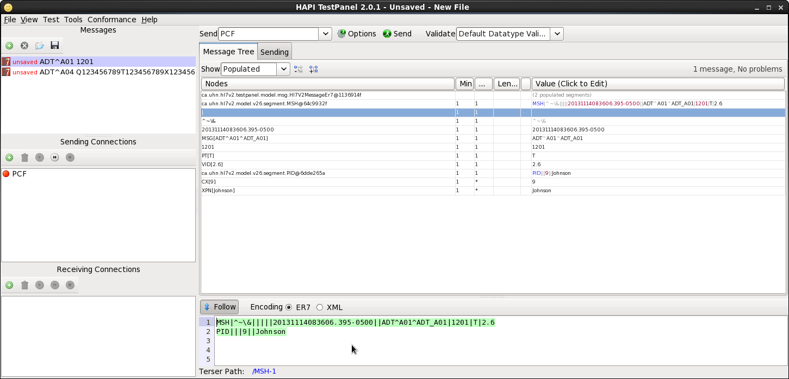

User's Guide
========

This user's guide assumes that the reader has installed all prerequisites and system components using the appropriate installation guides.


####Start the Hospital Information System
```
cd <BASE_DIR>/myHealth/fuseServiceWorks/jboss-eap-6.1/bin
./standalone.sh -c standalone-full.xml
```


####Start the Patient Care Facility and Laboratory Information System
```
cd <BASE_DIR>/myHealth/fuse/jboss-fuse-6.0.0.redhat-024
./bin/fuse
```


####Start the Android client application
In the FuseIDE, right click on the root-leval "android-client" folder and select Run As -> Android Application


####Open the HAPI Test Panel
If Java Web Start has not been installed then install it
```
su -c "yum -y install icedtea-web"
```

[Click Here](http://hl7api.sourceforge.net/hapi-testpanel/jnlp/launch.jnlp) to open the HAPI Test Panel

Click the "Create Samples" button

Change the port number to 8888 on the default Sending Connection - this is the Patient Care Facility's MLLP port

####Create the Patient Admit message

Click the Green "plus" icon in the "Messages" section on the left to add a new message.

Create a V6 ADT A01 message.

Copy and paste the message below into the text area at the bottom center of the test panel
```
MSH|^~\&|||||20131114083606.395-0500||ADT^A01^ADT_A01|1201|T|2.6
PID|||9||Johnson
```



Take a moment to look over the message. In the "PID" section on the second line of the message, note that the patient id is 9, and the patient's surname is "Johnson". Sending this message will result in a new entry in the "patient" table of the database - a patient with an identifier of 9 and a surname of Johnson.

Note here also that, until the change is made to ActiveMQ, the only supported patient identifiers are the numbers 1 through 9. This restriction will be removed with the change to ActiveMQ.

####Send the Patient Admit message
With the ADT A01 messasge selected, click the "Send" button at the top of the test panel.
After the message is sent, the text area in the "Sending" tab should indicate that the message was sent and that a response was received.

We now have a patient loaded in the database and can use the Android client to order a test from the lab.

####Order a Test
On the Android client, open the redHatRA application.

Enter the URL of the Patient Care Facility in the upper text field. If the Patient Care Facility is running on the same machine as the Android client then the URL of the Patient Care Facility will be tcp://10.0.2.2:1883

Enter "9" in the lower text field to represent the ID of the patient and click the "connect" button. Note that this connection is per-patient and represents a vested interest in this patient. In a real-world scenario, several doctors and/or nurses would likely have a vested interest in the same patient and any given doctor or nurse would have a vested interest in multiple patients.

Click the "Order Lab Test" button.

Select a Test Type from the dropdown and click the "Place Order" button to order the test.

The "Results" screen should appear immediately with the test results shown (in the real world it would take hours or days for the results to come back). The patient's surname should also be shown at the top of the screen (the surname was pulled in when the Patient Information System performed the patient lookup).


