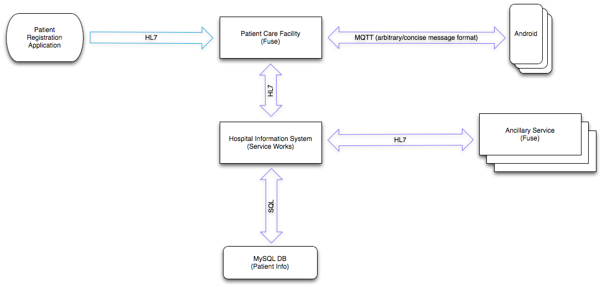

User's Guide
========

This user's guide assumes that the reader has installed all prerequisites and system components using the appropriate installation guides.


##Start the Hospital Information System
```
cd <BASE_DIR>/myHealth/fuseServiceWorks/jboss-eap-6.1/bin
./standalone.sh -c standalone-full.xml
```


##Start the Patient Care Facility and Laboratory Information System
```
cd <BASE_DIR>/myHealth/fuse/jboss-fuse-6.0.0.redhat-024
./bin/fuse
```


##Start the Android client application
In the FuseIDE, right click on the root-leval "android-client" folder and select Run As -> Android Application


##SOpen the HAPI Test Panel
If Java Web Start has not been installed then install it
```
su -c "yum -y install icedtea-web"
```

[Click Here](http://hl7api.sourceforge.net/hapi-testpanel/jnlp/launch.jnlp) to open the HAPI Test Panel



