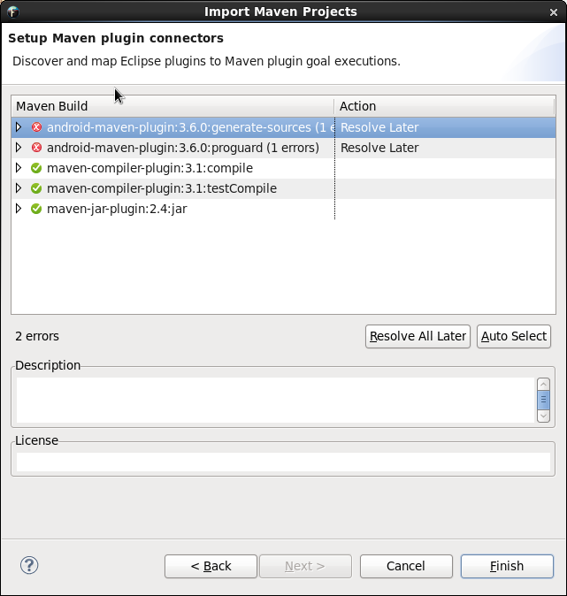
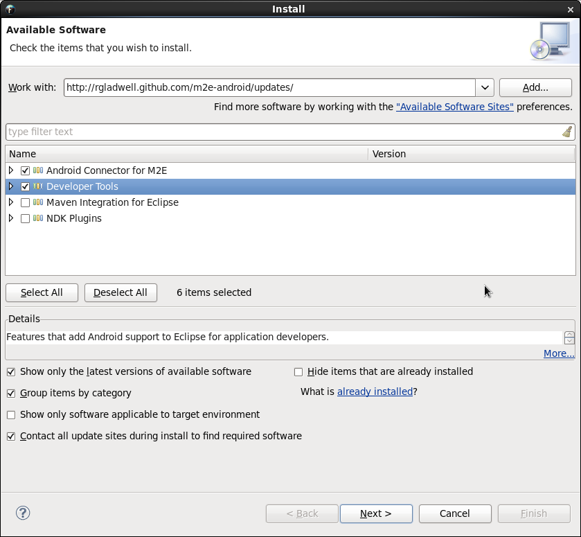
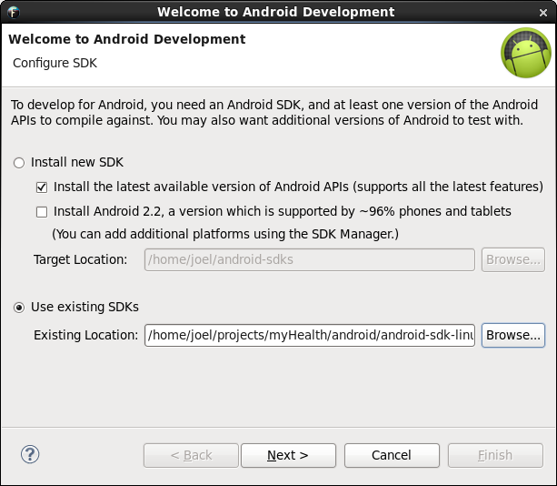
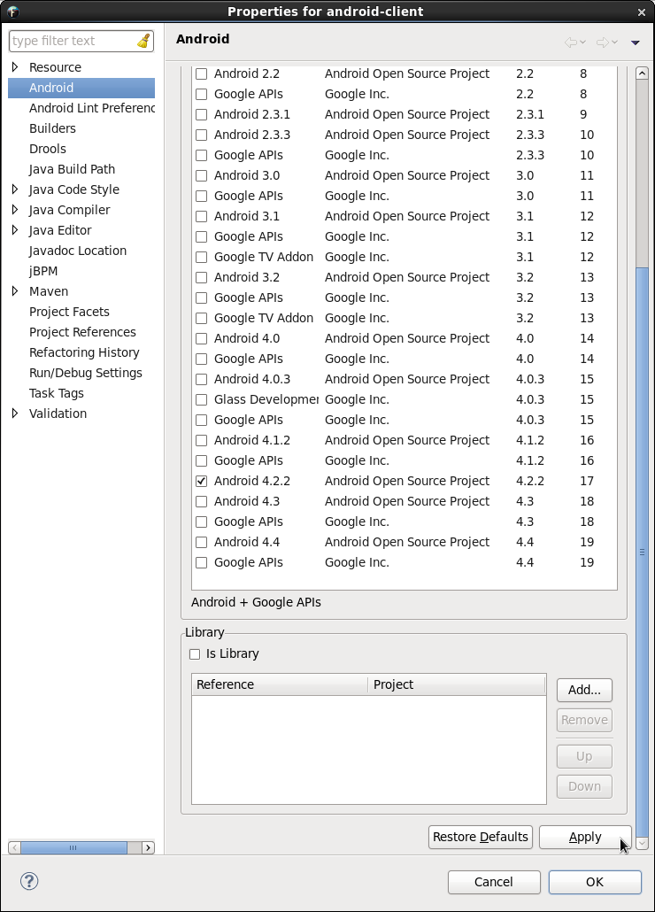

Android Client Installation
========
Introduction
--------
This document describes the process for setting up the Android client software to run on a device simulator.

Installation Guide
--------

### Install the Android SDK

[Download a copy of the Android SDK](http://developer.android.com/sdk/index.html)

Extract the contents of the compressed sdk folder into \<base_dir\>/myHealth/android

This should result in a new server directory named \<base_dir\>/myHealth/android/android-sdk-linux

Open the pom.xml file and set the android.sdk.path property as shown below (replace BASE_DIR appropriately) and save it.
```
<android.sdk.path>BASE_DIR/myHealth/android/android-sdk-linux</android.sdk.path>
```

Update the Android SDK
```
\<base_dir\>/myHealth/android/android-sdk-linux/tools/android update sdk --no-ui --obsolete --force
```

Install 32 bit libraries if necessary. For RHEL6:
```
su -c "yum install glibc.i686 glibc-devel.i686 zlib-devel.i686 ncurses-devel.i686 libX11-devel.i686 libXrender.i686 libXrandr.i686"
su -c "yum upgrade libstdc++"
su -c "yum install libstdc++.i686"
```

### FuseIDE setup

Open the Fuse IDE.

Right click anywhere in the Package Explorer View.

Import...

Maven -> Existing Maven Projects

Browse to \<base_dir\>/myHealth/android/redHatRA

On the "Setup Maven plugin connectors" screen, click "Resolve All Later"




After the project is imported, install the Android Connector for M2E and Developer Tools by going to Help -> Install New Software...
In the "Work With" text field, enter http://rgladwell.github.com/m2e-android/updates/ and select the first two items.



Set the Android SDK location by going to Window -> Preferences -> Android



Set the Android target platform by going to Window -> Preferences -> Android



Be sure to **click the apply button** and then click ok on all open dialogs

Installation is complete. The client application should be up and running.


**Note for NVIDIA users:** If an NVIDIA card is in use with the open source nouveau drivers then a libGL error may show up:

*libGL error: failed to load driver: nouveau*

The solution to this problem is to install the proprietary NVIDIA drivers. For RHEL6:
```
su -c "rpm --import http://elrepo.org/RPM-GPG-KEY-elrepo.org"
su -c "rpm -Uvh http://elrepo.org/elrepo-release-6-5.el6.elrepo.noarch.rpm"
su -c "yum install nvidia-detect"
```


