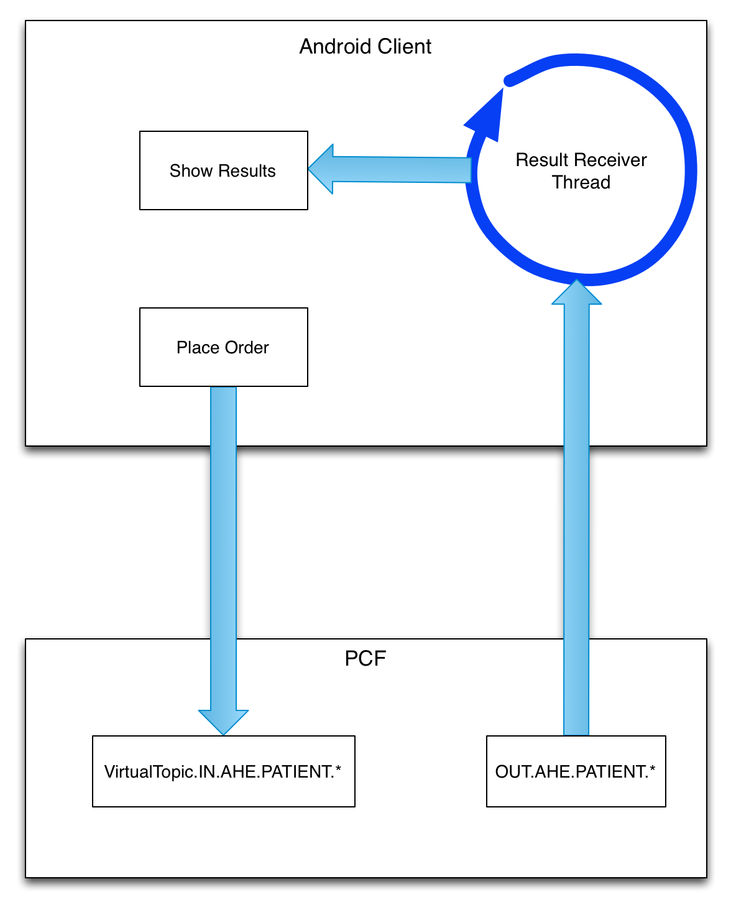

The Android Client
========
Introduction
--------
This document outlines the basic architecture of the Android client.

Overview
--------
The Android client is a minimal application that sends observation requests for the lab and listens for incoming results. The user clicks a connect button to start the "Result Receiver" thread and subscribe to the Patient Care Facility's OUT.AHE.PATIENT.* topic. A "Place Order" button kicks off an "Order Sender" task that publishes the observation request to the Patient Care Facility's VirtualTopic.IN.AHE.PATIENT.* topic.

