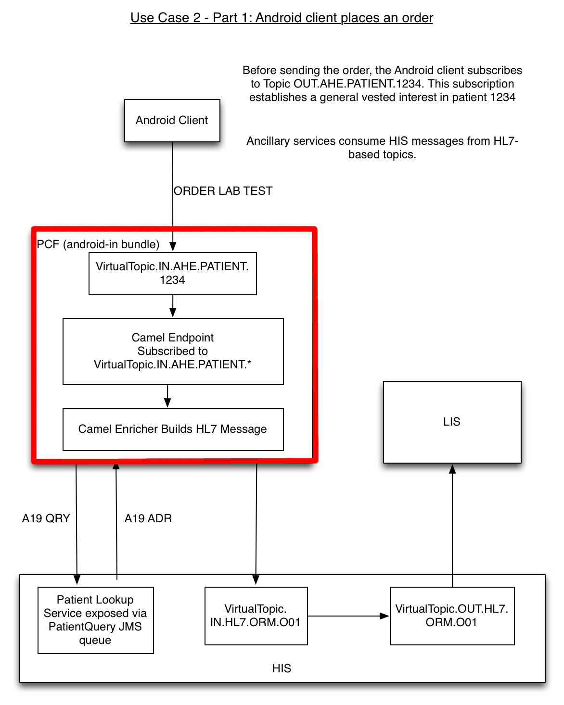

The Android In Bundle
========
Introduction
--------
This document outlines the basic architecture of the Patient Care Facility's "Android In" bundle.

Overview
--------
As it's name suggests, the "Android In" bundle is responsible for processing messages that come in from Android clients. In the diagram below, "AHE" (Abbreviated HL7 Exchange) is the name that was arbitrarily given to the concise message format used by Android clients within this reference architecture. The client publishes an AHE order request. The "Android In" bundle then parses that request, uses a camel enricher to build a proper HL7 ORM-O01 message with the results of a patient lookup request, and finally sends the ORM-O01 message to the Hospital Information System for processing.

Notice that the Android clients will publish and subscribe to patient-based topics instead of HL7 based topics. This strategy provides scalability because each patient would be associated with a very manageable number of care givers and each topic would therefore have a manageable number of publishers and subscribers.

