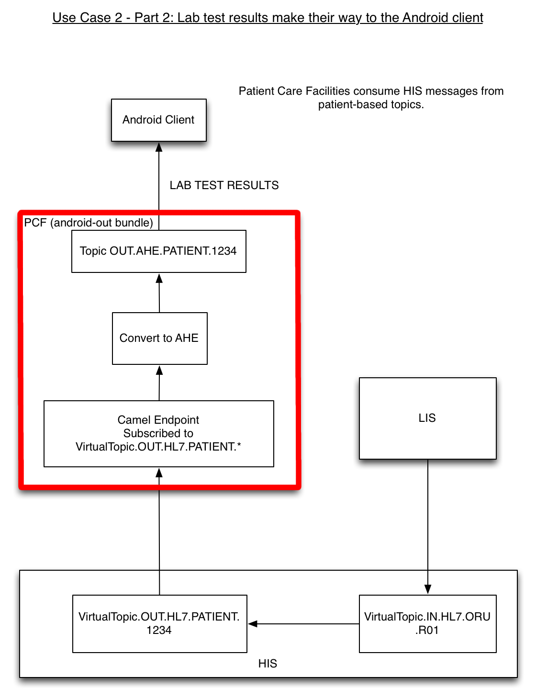

The Android Out Bundle
========
Introduction
--------
This document outlines the basic architecture of the Patient Care Facility's "Android Out" bundle.

Overview
--------
As it's name suggests, the "Android Out" bundle is responsible for processing messages that go out to Android clients. In the diagram below, "AHE" (Abbreviated HL7 Exchange) is the name that was arbitrarily given to the concise message format used by Android clients within this reference architecture. The "Android Out" bundle receives the HL7 ORU-R01 messages from the Hospital Information System and converts them to AHE for Android clients to consume.

