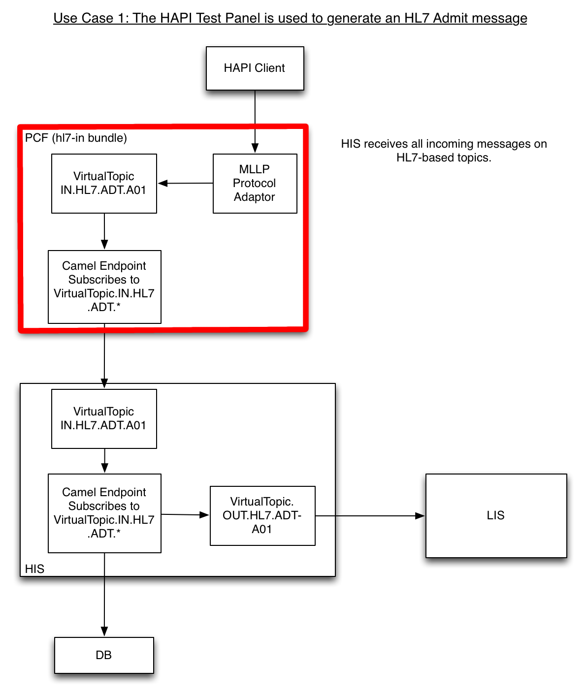

The HL7 In Bundle
========
Introduction
--------
This document outlines the basic architecture of the Patient Care Facility's "HL7 In" bundle.

Overview
--------
The "HL7 In" bundle is responsible for processing incoming HL7 messages. The patient admit message (ADT-A01) is the only HL7 message that is currently supported by the Patient Care Facility. The Patient Registration Application publishes admit messages to the Patient Care Facility's VirtualTopic.IN.HL7.ADT.A01 topic and the HL7 In bundle routes them to the Hospital Information System which has a topic that shares the same name.

For convenience, an MLLP protocol adaptor is included - this allows admit messages to be sent in from the HAPI Test Panel.

