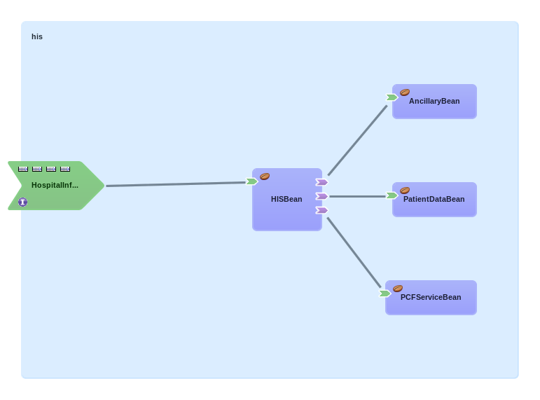

The Hospital Information System
========
Introduction
--------
This document outlines the basic architecture of the Hospital Information System.

Overview
--------
The Hostpital Information System is a Switchyard application. A patient lookup service is exposed via JMS to support patient queries. Incoming observation requests are forwarded to ancillary services. Incoming patient admit messages are stored in the database and forwarded to ancillary services.

The *HISBean* represents the Hospital Information System and acts as a central hub, delegating tasks and passing information to the other components. HIS functionality is exposed to the outside world via the "HospitalInformationSystem" service which contains all of the necessary JMS bindings.

The *AncillaryBean* represents ancillary services. The AncilllaryBean offers an ability to send information to ancillary services. In practice, this sending of information is done by publishing to the virtual topic to which ancillary services are subscribed (VirtualTopic.OUT.HL7.*.*).

The *PCFBean* represents patient care facilities. The PCFBean offers an ability to send information to patient care facilities. In practice, this sending of information is done by publishing to the virtual topic to which patient care facilities are subscribed (VirtualTopic.OUT.HL7.PATIENT.*).

The "PatientDataBean" represents stored patient data and implements the CRUD operations that are needed by the HISBean.

